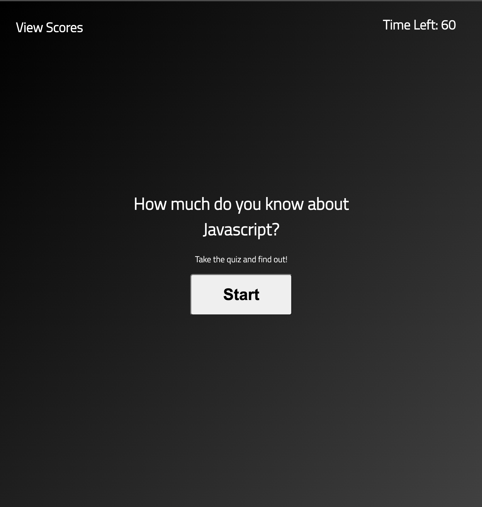

Homework Week 4 - Quiz Game

Description:

Make a Javascript quiz that is timed, and allows you to save your score using local storage.  

Link to repo:

https://github.com/campbelllm/quizGame

Link to gitHub pages site:

https://campbelllm.github.io/quizGame/

Preview of site:
 

